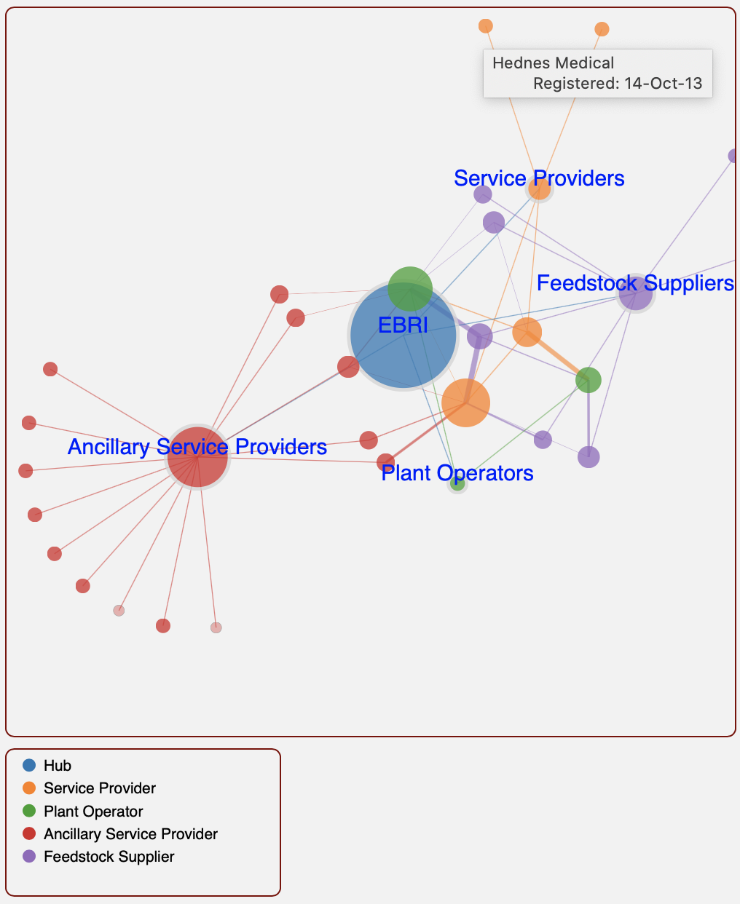
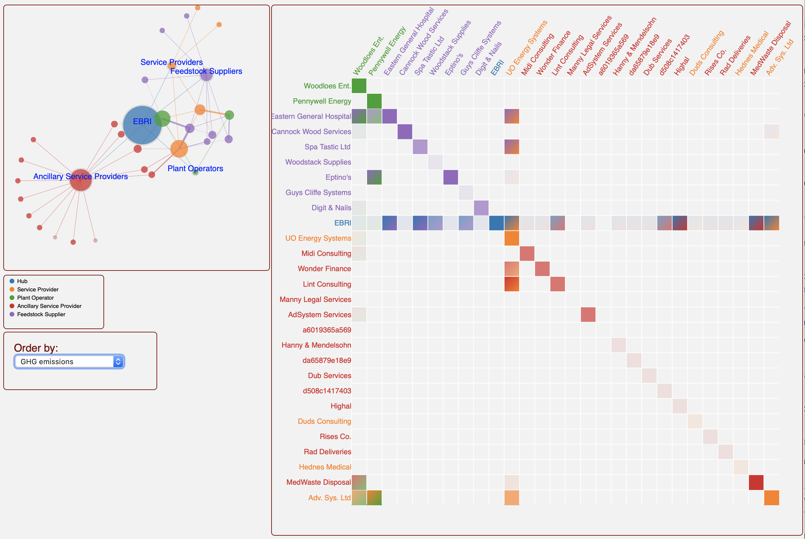

Second time using this project as  a [demonstrator](../ebri_dashboard.html) in the last few months, so I'm finally getting around to documenting the story behind it. I spent a month as a visiting researcher with the [___Operations and Information Management___](https://www2.aston.ac.uk/aston-business-school/research/departments/oim) group at Aston Business School in 2018. During that period I worked with my host, [Victoria Uren](https://research.aston.ac.uk/en/persons/victoria-uren) on a project with [EBRI](https://bioenergy-for-business.org) (what used to be the European Bioenergy Research Institute) &ndash; to model a digital business network (DBN) from which EBRI could provide information and services to local companies within the ___Energy from Waste (EfW)___ sector. 

## The Problem
 
__EfW__ involves fairly complex value chains, with a variety of organisations feeding into or deriving value from the sector. Our task was to model this environment, to help businesses identify:

 * partners with shared business strategy or objectives 
 * companies to whom they could provide services 
 * companies providing services they require.
  
Within this model standard and alternative KPIs would be used to track value created by or delivered to an organisation. KPIs would therefore also serve as a means to identify shared values between organisations.

### Benefits for EBRI

The hub of the local EfW community, EBRI pushes information on services and the local economy to its network. A model that describes the sector and provides a common language that ensures better understanding of individual and shared value within the network. This would allow EBRI to more effectively customise service delivery to target organisations. 

### Benefits for Organisations within the Sector

All organisations within the DBN benefit from access to a central point from which to locate information and services. SMEs especially stand to gain; startup costs within the EfW sector are relatively high, making it more difficult for especially plants to set up, and for SMES in general to operate competitively. Identification of partners with shared strategy and values helps smaller companies to build economies of scale, lower costs and increase competitiveness. 

## Vision Demonstrator

A ___vision demonstrator___ is a medium-fidelity, visualisation-based prototype used to demonstrate ___proof of concept___. Hosting the [vision demonstrator](../ebri_dashboard.html) this project online allowed me to continue to collaborate with EBRI and Aston Business School beyond the month I worked on site. Because we were still iterating between requirements analysis and design interactivity was key to exploring different relationships within the network, and how these changed based on which KPI(s) we were defining and/or assessing. 

Multiple options exist for creating an interactive website; the decision on what fits a specific case is based on current skills, time, access to a specific technology (yourself and your client), data and task complexity, among others. JavaScript is convenient for quick prototyping client-side; to read in the data ([sample dummy data](../twothreethree/dashboard/data/ebri/dummy_network.json)) we were working with I made use of PHP. I chose [D3](http://d3js.org) because it allowed me to reuse previous work and continue to learn to use the library for visual data exploration.

{::nomarkdown} 

<!-- table>
 <tbody>
 <tr>
  <td width = "65%" >
    At its simplest, a network diagram is an obvious visualisation approach for a digital business network. However, networks can get busy very quickly; beyond a fairly small number of nodes and links folding and/or filtering is necessary to be able to obtain a good understanding of the relationships within the network overall and selected data subsets.
  </td><td width = "35%" rowspan = "3">
    
  </td>
 </tr><tr>
  <td width = "65%" >
   For even a relatively small geographical region a much larger number of organisations will interact with the EfW sector. To simplify exploration at this stage, and to maintain privacy of the actual organisations interviewed we created a <a href = "../twothreethree/dashboard/data/ebri/dummy_network.json">dummy network</a> to visualise a representative sample of the actual dataset and the network as a whole, based on the structure of the data collected. The snapshot contains only 26 organisations, along with the hub. 
  </td>
 </tr><tr>
  <td width = "65%" >
  This view focuses on a single relationship, displaying one link type &ndash; organisation type &ndash; for each company shown in the network.
  </td>
 </tr><tr>
  <td width = "65%" >
  </td><td width = "35%" ></td>
 </tr>
 </tbody>
</table -->

{:/}

At its simplest, a network diagram is an obvious visualisation approach for a digital business network. However, networks can get busy very quickly; beyond a fairly small number of nodes and links folding and/or filtering is necessary to be able to obtain a good understanding of the relationships within the network overall and selected data subsets.

For even a relatively small geographical region a much larger number of organisations will interact with the EfW sector. To simplify exploration at this stafe, and to maintain privacy of the actual organisations interviewed we created a <a href = "../twothreethree/dashboard/data/ebri/dummy_network.json">dummy network</a> to visualise a representative sample of the actual dataset and the network as a whole, based on the structure of the data collected. The snapshot contains only 26 organisations, along with the hub. 

This view focuses on a single relationship, displaying one link type &ndash; organisation type &ndash; for each company shown in the network. And all organisations are connected through an intermediary "dummy" node to the hub, EBRI. This allows organisations to use immediate contacts as a bridge to link to other organisations, in addition to through the hub.

<table>
 <tbody><tr>
  <td>
    
  </td>
  </tr></tbody>
</table>

### Sample Use Cases

A key requirement was support for exploring similarity between organisations, where similarity was tied to one or more KPIs. An alternative to a network diagram in such cases is to use a matrix, especially useful for examining pairwise and relative similarity. The following use cases demonstrate how this was done.

#### Location, Transport & Logistics

A key product in the EfW sector is [___feedstock___](images/Ontology_FeedStock.pdf) that plants convert to energy. Each plant will consume a subset of feedstock types at regular cycles, e.g., x amount of cork daily, y amount of wood chips weekly. Sourcing feedstock is influenced by location of suitable and preferred feedstock, cost and amount available per supplier, in addition to transport costs. Sourcing local is critical for this sector, in part to satisfy regulations, and also to combat NIMBY and win hearts and minds, by demonstrating value for the local economy over negative reputation for environmental emissions and sustainability, among others. However, this comes with  Satisfying these conditions may however mean targeting multiple SMEs rather than a single, large supplier. 
There are two ways to make a decision about sourcing suppliers; by reordering the matrix to show, 

  * from the consumer's viewpoint (an EfW plant), based on preferred feedstock and other operational factors

  * from the supplier's viewpoint, based on delivery cycles for the whole network
<table>
 <tbody><tr>
  <td>
    
  </td>
  </tr></tbody>
</table>

#### Alternative KPIs for Value

[___Value___](images/Ontology_Value.pdf) may be defined in different ways for an organisation. A simple example is the net GHG emissions for organisations within the network. Another KPI is distance from other organisations, which feeds into costing and sourcing of services.

<table>
 <tbody><tr>
  <td>
    
  </td>
  </tr></tbody>
</table>
